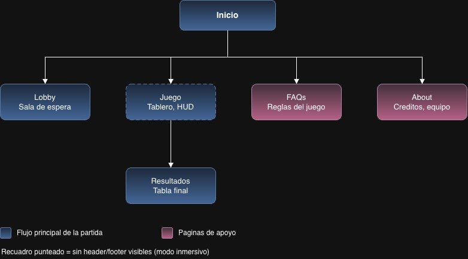
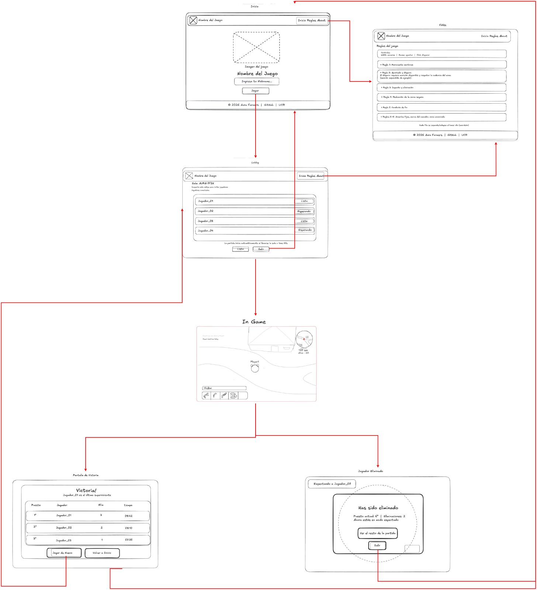

# Diseño (Equipo Aura Farmers)

CI-0137 Desarrollo de Aplicaciones Web, UCR — Entrega 2: Estructura del sitio y wireframes.

Este documento explica las decisiones de diseño tomadas antes de maquetar: el mapa del sitio, el
wireflow del flujo principal de una partida, el proceso de Crazy 8's y los wireframes digitales de
cada pantalla.

## 1. Mapa del sitio



| Página | Ruta prevista | Header/Footer visibles | Descripción |
|---|---|---|---|
| Inicio (Bienvenida) | `/` | Sí | Primera pantalla. Logo, nombre e ingreso de nickname antes de pasar al lobby. |
| Lobby / sala de espera | `/lobby` | Sí | Código de sala, lista de jugadores conectados y su estado (Listo/Esperando), mini-tutorial opcional. |
| Juego / Tablero | `/juego` | **No (modo inmersivo)** | Pantalla principal de la partida: tablero, HUD de vida/armas, minimapa y timer de zona. |
| Resultados | `/resultados` | Sí | Tabla final de posiciones al terminar la partida (accesible solo al terminar el juego). |
| FAQs / Reglas | `/faqs` | Sí | Explicación completa de la mecánica y las adaptaciones propias del equipo . |
| About / Créditos | `/about` | Sí | Página secundaria elegida por el equipo: integrantes, roles y créditos de recursos externos. |

El recuadro punteado en el mapa (Lobby, Juego) indica pantallas sin header/footer visibles
(modo inmersivo); las de borde sólido (FAQs, About) sí muestran los elementos globales.

## 2. Wireflow del flujo principal



Flujo mínimo requerido, tal como quedó representado:

1. **Entrar**: en *Inicio*, el jugador escribe su nickname y presiona **Jugar**; puede consultar
   *FAQs* antes de entrar sin perder su progreso.
2. **Esperar el inicio de la partida**: en el *Lobby*, ve el código de sala, quiénes se van uniendo
   y su estado; marca **Listo**. La partida arranca cuando todos están listos o a los 60s.
3. **Jugar**: en *Juego/Tablero* (modo inmersivo, sin header/footer) se mueve, ataca y ve su vida,
   armas, minimapa y el temporizador de la zona segura en tiempo real.
4. **Terminar**: al perder, pasa a *Jugador Eliminado* (ve su puesto y puede quedarse a espectar);
   al ganar (o al terminar la partida), todos ven la *Pantalla de Victoria* con la tabla de posiciones.
5. Desde el resultado, puede **Jugar de nuevo** (vuelve al Lobby con la misma sala) o **Volver a Inicio**.

## 3. Crazy 8's y acuerdos de grupo

Ver [`crazy8s/`](./crazy8s/): fotos de los sketches en papel de cada integrante y los acuerdos a los
que llegó el equipo en [`crazy8s/acuerdos-de-grupo.md`](./crazy8s/acuerdos-de-grupo.md).

Decisiones principales que salieron de esa sesión:

- HUD del tablero minimalista y en las esquinas (vida abajo-izquierda, armas en fila, minimapa +
  timer de zona + contador de jugadores vivos arriba-derecha, feed de eliminaciones arriba-izquierda).
- El tablero oculta header/footer para maximizar el área de juego.
- El lobby usa un código de sala compartible en vez de invitaciones por link.
- La eliminación es un intermedio con opción de espectar, no una salida forzada.
- Los resultados muestran puesto, eliminaciones y tiempo de cada jugador.

## 4. Wireframes digitales

| # | Pantalla | Archivo |
|---|---|---|
| 1 | Bienvenida / Inicio | [`wireframes/01-bienvenida-inicio.png`](./wireframes/01-bienvenida-inicio.png) |
| 2 | Lobby / sala de espera | [`wireframes/02-lobby.png`](./wireframes/02-lobby.png) |
| 3 | Juego / Tablero | [`wireframes/03-juego-tablero.png`](./wireframes/03-juego-tablero.png) |
| 4 | FAQs / Reglas | [`wireframes/04-faqs-reglas.png`](./wireframes/04-faqs-reglas.png) |
| 5 | About / Créditos (página secundaria) | [`wireframes/05-about-creditos.svg`](./wireframes/05-about-creditos.png) |
| — | Elementos globales: header y footer | [`wireframes/globals/header-footer.svg`](./wireframes/globals/header-footer.png) |

Pantallas adicionales:

- [`wireframes/extra/jugador-eliminado.png`](./wireframes/extra/jugador-eliminado.png) — interludio de eliminación con modo espectador.
- [`wireframes/extra/pantalla-victoria.png`](./wireframes/extra/pantalla-victoria.png) — tabla de posiciones final.

### Notas de cada pantalla

- **Bienvenida/Inicio**: logo grande, animación de entrada (placeholder), campo de nickname y botón Jugar.
- **Lobby**: código de sala visible, lista de jugadores con estado Listo/Esperando, arranque automático.
- **Juego/Tablero**: vida (barra inferior), inventario de armas (íconos inferiores), minimapa con
  posición del jugador y puntos de interés, timer de reducción de zona, contador de jugadores vivos,
  feed de eventos (p. ej. "Player4 has been shot by Player3").
- **FAQs/Reglas**: controles primero, luego cada regla en un acordeón independiente.
- **About/Créditos**: equipo Aura Farmers con rol de cada integrante,
  créditos de recursos externos (tipografía, íconos, sonido, imágenes) y enlace al repositorio.

## 5. Organización de la carpeta `design/`

```
design/
├── design.md                     ← este documento
├── sitemap/
│   └── sitemap.jpg
├── wireflow/
│   └── wireflow-partida.png
├── crazy8s/
│   ├── README.md                 ← cómo agregar tu sketch
│   ├── acuerdos-de-grupo.md
│   └── integrante-01/            ← una carpeta por persona
├── wireframes/
│   ├── 01-bienvenida-inicio.png
│   ├── 02-lobby.png
│   ├── 03-juego-tablero.png
│   ├── 04-faqs-reglas.png
│   ├── 05-about-creditos.svg
│   ├── globals/
│   │   └── header-footer.svg
│   └── extra/
│       ├── jugador-eliminado.png
│       └── pantalla-victoria.png
```
